# Slug-Ig-Crawler — reference

This document is part of the [Slug-Ig-Crawler](../README.md) documentation. Paths are relative to the repository root unless noted.

# Architecture overview

The application follows a layered architecture with clear separation of concerns:

```
┌─────────────────────────────────────────────────────────────┐
│                    CLI Layer (cli.py)                        │
│              Command-line argument parsing                   │
└──────────────────────┬──────────────────────────────────────┘
                       │
                       ▼
┌─────────────────────────────────────────────────────────────┐
│              Pipeline Layer (pipeline.py)                   │
│         Orchestrates scraping workflow                      │
└──────────────────────┬──────────────────────────────────────┘
                       │
                       ▼
┌─────────────────────────────────────────────────────────────┐
│         Configuration Layer (config.py)                      │
│    Loads and validates TOML configuration                   │
└──────────────────────┬──────────────────────────────────────┘
                       │
                       ▼
┌─────────────────────────────────────────────────────────────┐
│         Backend Layer (backends/selenium_backend.py)        │
│    Manages WebDriver lifecycle and browser automation       │
└──────────────────────┬──────────────────────────────────────┘
                       │
        ┌──────────────┴──────────────┐
        ▼                              ▼
┌──────────────────┐         ┌──────────────────────┐
│  Page Objects    │         │  Data Extraction     │
│  (pages/)        │         │  (utils.py)          │
└──────────────────┘         └──────────────────────┘
        │                              │
        └──────────────┬──────────────┘
                       ▼
┌─────────────────────────────────────────────────────────────┐
│         Data Persistence Layer                               │
│    Local files, GCS upload, database enqueueing             │
└─────────────────────────────────────────────────────────────┘
```

### Runtime mode selection

At `Pipeline.run()`, the effective mode is chosen **after** config load (the `[main].mode` value in TOML may be overwritten):

1. **URL file mode (mode 2)** — if `[data].urls_filepath` is set **and** that path exists on disk.
2. **Profile mode (mode 1)** — else if `[main].target_profiles` is non-empty.
3. Otherwise the run logs a warning and does nothing.

### Config template and Thor

- **This repo:** use `config.example.toml` as a starting point (copy to `config.toml` and edit). It includes a `[trace]` section required by `Pipeline`.
- **Thor** does not read this README; it generates job configs from its own template (e.g. `thor/assets/base_config.toml`) and invokes Docker with `DOCKER_COMPOSE_FILE` pointing at **its** compose file. The **service name** `Slug-Ig-Crawler` and the usual entrypoint `Slug-Ig-Crawler --config /job/config.toml` should stay compatible with that flow.

---

## Entry Point: CLI

### `cli.py`

The `cli.py` module serves as the **single entry point** for the application. It handles command-line argument parsing and initializes the scraping pipeline.

**Commands:**

| Command | Purpose |
|--------|---------|
| `run` (default) | Load config and run the pipeline. |
| `bootstrap` | Download Chrome for Testing + ChromeDriver for **`143.0.7499.169`** (override with `IGSCRAPER_CFT_FULL_VERSION`) into `~/.slug/browser/…` and copy sample config to `~/.slug/config.toml` if absent (`--force` / `--force-config` available). Re-downloads if the cache is not the pinned full version (see `~/.slug/browser/<platform>/.cft-pinned-version`). |
| `show-config` | Print the bundled sample TOML plus discovered cache config/cookie paths. |
| `save-cookie` | Open Instagram login flow and save JSON cookies to `~/.slug/cookies/<browserVersion>_<username>_<timestamp>.json` (also updates `~/.slug/cookies/latest.json`). Uses the **same Chrome + ChromeDriver pair as `bootstrap`** (`~/.slug/browser/...`) unless you set both `CHROME_BIN` and `CHROMEDRIVER_BIN`; **major versions must match** (checked before launch). If bootstrap is missing on **macOS**, the tool falls back to **`/Applications/Google Chrome.app/Contents/MacOS/Google Chrome`** plus **`chromedriver` on `PATH`** (e.g. Homebrew) when both exist. **Default:** ephemeral Chrome profile (no `--user-data-dir`, matching the stable Linux-UA + `--remote-debugging-pipe` + CDP `navigator.platform` flow). Set **`IGSCRAPER_COOKIE_USE_USER_DATA_DIR=1`** or **`CHROME_USER_DATA_DIR`** for a persistent profile under `~/.slug/chrome-user-data/save-cookie/<username>/`. `IGSCRAPER_OMIT_CHROME_USER_DATA_DIR=1` forces ephemeral. Runs in a **fresh Python subprocess** by default; `IGSCRAPER_COOKIE_NO_SUBPROCESS=1` forces in-process (debug only). **macOS:** If Chrome for Testing crashes with `multi-threaded process forked` / fork pre-exec, run from **Terminal.app** instead of an IDE terminal; the CLI sets `OBJC_DISABLE_INITIALIZE_FORK_SAFETY=YES` before Selenium loads. `bootstrap` strips `com.apple.quarantine` from cached ChromeDriver when needed; you can also run `xattr -d com.apple.quarantine $(which chromedriver)` manually. |
| `list-cookies` | Print only cached cookie JSON paths from `~/.slug/cookies`. |
| `version` | Print installed package version. |

**Key behavior:**

- `main()` resolves the config path: explicit `--config`, else **`~/.slug/config.toml`** if present, else exits with a hint to pass `--config` or run **`bootstrap`**.
- Then instantiates `Pipeline` and calls `pipeline.run()`.

**Usage:**
```bash
Slug-Ig-Crawler --config config.toml
Slug-Ig-Crawler bootstrap
Slug-Ig-Crawler show-config
Slug-Ig-Crawler save-cookie --username your_instagram_username
Slug-Ig-Crawler list-cookies
Slug-Ig-Crawler version
Slug-Ig-Crawler   # same as run; uses ~/.slug/config.toml when present
```

**Arguments by command:**

- `run` (default)
  - `--config <path>` (optional): TOML path; if omitted, CLI autoloads `~/.slug/config.toml` when present.
  - Example:
    - `Slug-Ig-Crawler --config ./config.toml`
    - `Slug-Ig-Crawler run --config /abs/path/config.toml`

- `bootstrap`
  - `--force` (optional): re-download Chrome + ChromeDriver even if cache already exists.
  - `--force-config` (optional): overwrite `~/.slug/config.toml` with bundled sample.
  - `--setup-postgres` / `--no-setup-postgres`: Postgres setup is enabled by default; use `--no-setup-postgres` to skip.
  - `--postgres-sql-file <path>` (optional): override SQL file path used by `--setup-postgres`.
  - Example:
    - `Slug-Ig-Crawler bootstrap --force`
    - `Slug-Ig-Crawler bootstrap --force-config`
    - `Slug-Ig-Crawler bootstrap`  # runs browser + config + postgres setup by default
    - `Slug-Ig-Crawler bootstrap --no-setup-postgres`
    - `Slug-Ig-Crawler bootstrap --setup-postgres --postgres-sql-file ./scripts/postgres_setup.sql`

- `show-config`
  - No arguments.
  - Example:
    - `Slug-Ig-Crawler show-config`

- `save-cookie`
  - `--username <instagram_username>` (**required**): used in cookie filename and session labeling.
  - Example:
    - `Slug-Ig-Crawler save-cookie --username your_instagram_username`

- `list-cookies`
  - No arguments.
  - Example:
    - `Slug-Ig-Crawler list-cookies`

- `version`
  - No arguments.
  - Example:
    - `Slug-Ig-Crawler version`

This document also includes a **[VS Code debugging (`launch.json`)](#vs-code-debugging-launchjson)** section below with a ready-to-paste debugger configuration for the same entry point.

---

## VS Code debugging (`launch.json`)

Use this when you open the **repository root** (the folder that contains `src/`) in VS Code or Cursor. Create **`.vscode/launch.json`** and paste the following. It sets `PYTHONPATH` to `src/` so `python -m igscraper` resolves the same way as in a shell where you exported `PYTHONPATH`, runs from `${workspaceFolder}` so relative paths in `config.toml` work, and uses the **Python** extension’s **debugpy** adapter (`"type": "debugpy"`). If your tooling only recognizes the older launch type, change every `"type": "debugpy"` to `"type": "python"`.

Adjust the `--config` argument if your TOML file is not named `config.toml` or does not live in the repo root. Select your virtual environment in the IDE **before** starting the debugger so breakpoints bind to the right interpreter.

```json
{
  "version": "0.2.0",
  "configurations": [
    {
      "name": "Slug-Ig-Crawler: CLI",
      "type": "debugpy",
      "request": "launch",
      "module": "igscraper",
      "cwd": "${workspaceFolder}",
      "args": ["--config", "config.toml"],
      "env": {
        "PYTHONPATH": "${workspaceFolder}/src"
      },
      "console": "integratedTerminal",
      "justMyCode": false
    },
    {
      "name": "Slug-Ig-Crawler: CLI (listen for debugger)",
      "type": "debugpy",
      "request": "launch",
      "module": "igscraper",
      "cwd": "${workspaceFolder}",
      "args": ["--config", "config.toml"],
      "env": {
        "PYTHONPATH": "${workspaceFolder}/src",
        "DEBUG_ATTACH": "1"
      },
      "console": "integratedTerminal",
      "justMyCode": false
    },
    {
      "name": "Slug-Ig-Crawler: Attach to debugpy",
      "type": "debugpy",
      "request": "attach",
      "connect": {
        "host": "localhost",
        "port": 5678
      },
      "pathMappings": [
        {
          "localRoot": "${workspaceFolder}",
          "remoteRoot": "${workspaceFolder}"
        }
      ],
      "justMyCode": false
    }
  ]
}
```

**Optional attach flow:** `Pipeline` can call `debugpy.listen` when `DEBUG_ATTACH=1` (see `pipeline.py`). Start **Slug-Ig-Crawler: CLI (listen for debugger)** first, then start **Slug-Ig-Crawler: Attach to debugpy** so the process unblocks and you can hit breakpoints.

---

## Core Components

### 1. Configuration Layer (`config.py`)

The configuration layer loads, validates, and processes settings from TOML files using Pydantic models.

**Key Classes:**

- **`Config`**: Main configuration container that aggregates:
  - `MainConfig`: Scraping behavior settings (mode, batch size, retries, `push_to_gcs`, `gcs_bucket_name`, etc.)
  - `DataConfig`: File paths and data storage settings
  - `LoggingConfig`: Logging configuration
  - `TraceConfig`: `thor_worker_id` and related trace fields

- **`ProfileTarget`**: Represents a single profile to scrape with `name` and `num_posts` fields

**Key Functions:**

- `load_config(path: str) -> Config`: 
  - Loads TOML file
  - Configures root logger
  - Returns validated `Config` object

- `expand_paths(section, substitutions, depth)`: 
  - Expands path placeholders (e.g., `{target_profile}`, `{date}`, `{datetime}`)
  - Resolves relative paths to absolute paths
  - Recursively processes nested configuration sections

**Configuration Structure:**
```toml
[main]
mode = 1
target_profiles = [{ name = "jaat.aesthetics", num_posts = 10 }]
headless = false
batch_size = 2
fetch_comments = true

[data]
output_dir = "outputs"
cookie_file = "~/.slug/cookies/latest.json"
posts_path = "{output_dir}/{date}/{target_profile}/posts_{target_profile}_{datetime}.txt"
metadata_path = "{output_dir}/{date}/{target_profile}/metadata_{target_profile}.jsonl"
```

### 2. Pipeline Layer (`pipeline.py`)

The `Pipeline` class orchestrates the entire scraping workflow, managing the browser lifecycle and coordinating profile scraping.

**Key Methods:**

- **`__init__(config_path: str)`**:
  - Loads master configuration
  - Validates `[trace].thor_worker_id` (required for `Pipeline`)
  - Initializes `SeleniumBackend`
  - Creates `GraphQLModelRegistry` for parsing network responses

- **`run() -> dict`**:
  - Starts the browser via `backend.start()`
  - Determines scraping mode (URL file if `data.urls_filepath` exists, else profile list; see [Runtime mode selection](#runtime-mode-selection))
  - Iterates through target profiles, calling `_scrape_single_profile()` for each
  - Ensures browser cleanup in `finally` block

- **`_scrape_single_profile(profile_target: ProfileTarget) -> dict`**:
  - Creates profile-specific configuration copy
  - Expands path placeholders with profile name and datetime
  - Opens profile page via `backend.open_profile()`
  - Collects post URLs via `backend.get_post_elements()`
  - Scrapes posts in batches via `backend.scrape_posts_in_batches()`
  - Returns results dictionary with `scraped_posts` and `skipped_posts`

- **`_scrape_from_url_file() -> dict`**:
  - Reads URLs from configured file
  - Filters out already processed URLs
  - Scrapes remaining URLs in batches

### 3. Backend Layer (`backends/selenium_backend.py`)

The `SeleniumBackend` class implements the `Backend` abstract interface, managing WebDriver lifecycle and browser automation.

**Key Methods:**

- **`start()`**:
  - Configures Chrome options (anti-detection, performance logging)
  - Environment-aware initialization:
    - **Always:** if `CHROME_BIN` / `CHROMEDRIVER_BIN` are set, those paths are used.
    - If `use_docker=True`: otherwise falls back to the image’s pinned Linux paths; adds Docker-specific flags (`--no-sandbox`, `--disable-dev-shm-usage`, …)
    - If `use_docker=False`: otherwise **optional `[main].chrome_binary_path` / `[main].chromedriver_binary_path` → built-in macOS defaults**
  - Validates Chrome and ChromeDriver version compatibility
  - Initializes Chrome WebDriver with appropriate binary locations
  - Patches driver with `patch_driver()` for security monitoring
  - Sets up network tracking via CDP commands
  - Authenticates using cookies via `_login_with_cookies()`
  - Initializes `ProfilePage` object and `HumanScroller`

- **`stop()`**:
  - Stops screenshot worker thread
  - Quits WebDriver and closes all browser windows
  - Finalizes screenshots (if enabled): generates video, uploads to GCS, cleans up local files

- **`_login_with_cookies()`**:
  - Navigates to `https://www.instagram.com/`
  - Loads cookies from pickle file specified in config
  - Adds cookies to WebDriver session
  - Refreshes page to apply authentication

- **`open_profile(profile_handle: str)`**:
  - Delegates to `profile_page.navigate_to_profile()`

- **`get_post_elements(limit: int) -> Iterator[str]`**:
  - Attempts to load cached post URLs from `posts_path`
  - If no cache exists, calls `profile_page.scroll_and_collect_()` to scrape fresh URLs
  - Saves collected URLs to cache file
  - Filters out already processed URLs by loading from `metadata_path`
  - Returns iterator of post URL strings

- **`scrape_posts_in_batches(post_elements, batch_size, save_every, ...)`**:
  - Opens posts in batches using `open_href_in_new_tab()`
  - For each post, calls `_scrape_and_close_tab()` to extract data
  - Saves intermediate results via `save_intermediate()`
  - Periodically saves final results via `save_scrape_results()`
  - Implements rate limiting with random delays between batches

- **`_scrape_and_close_tab(post_index, post_url, tab_handle, main_window_handle, debug)`**:
  - Switches to post's tab
  - Extracts post metadata:
    - Title/header data via `get_post_title_data()`
    - Media (images/videos) via `media_from_post_gpt()` - handles carousel posts with improved robustness
    - Likes via `get_section_with_highest_likes()`
    - Comments via `scrape_comments_with_gif()` or `_extract_comments_from_captured_requests()`
  - Handles errors gracefully, returning error dictionaries
  - Ensures tab closure and window switching in `finally` block

- **`_finalize_screenshots()`**:
  - Shutdown-time artifact finalization (runs after browser shutdown, before process exit)
  - Generates MP4 video from all `.webp` screenshots in `shot_dir` (2.5 FPS, 640p height)
  - Uploads video to GCS bucket at `gs://{bucket}/vid_log/{video_name}.mp4`
  - Deletes all local screenshots and video file after successful upload
  - Works for both PROFILE (mode 1) and POST (mode 2) jobs
  - Errors are logged but don't block shutdown

- **`_extract_comments_from_captured_requests(driver, config, batch_scrolls)`**:
  - Uses `ReplyExpander` to expand comment threads
  - Captures GraphQL network requests via `capture_instagram_requests()`
  - Parses responses using `GraphQLModelRegistry`
  - Handles rate limiting with exponential backoff
  - Saves parsed comment data to `post_entity_path`

- **`open_href_in_new_tab(href, tab_open_retries)`**:
  - Executes JavaScript to open URL in new tab
  - Waits for new window handle to appear
  - Returns the new window handle

### 4. Page Objects (`pages/`)

Page objects encapsulate page-specific interactions using the Page Object Model pattern.

#### `base_page.py`

Base class providing common WebDriver operations:

- `find(locator)`: Waits for and returns a single element
- `find_all(locator)`: Waits for and returns all matching elements
- `click(element)`: Clicks element using JavaScript
- `scroll_into_view(element)`: Scrolls element into viewport

#### `profile_page.py`

Handles Instagram profile page interactions:

- **`navigate_to_profile(handle: str)`**:
  - Constructs profile URL: `https://www.instagram.com/{handle}/`
  - Navigates to URL
  - Waits for page sections to load

- **`get_visible_post_elements() -> List[WebElement]`**:
  - Finds post container elements using XPath
  - Extracts all `<a>` tags containing post links
  - Returns list of WebElement objects

- **`scroll_and_collect_(limit: int) -> tuple[bool, List[str]]`**:
  - Scrolls profile page using `HumanScroller`
  - Collects unique post URLs from visible elements
  - Periodically captures GraphQL data via `registry.get_posts_data()`
  - Stops when limit reached or no new posts loaded
  - Returns tuple: `(is_data_saved, list_of_urls)`

- **`extract_comments(steps)`**:
  - Delegates to `scrape_comments_with_gif()` utility function

### 5. Data Extraction and Parsing

#### GraphQL Model Registry (`models/registry_parser.py`)

The `GraphQLModelRegistry` class parses GraphQL API responses captured from network requests.

**Key Methods:**

- **`__init__(registry, schema_path)`**:
  - Initializes model registry mapping patterns to Pydantic models
  - Loads flatten schema from YAML file

- **`get_posts_data(config, data_keys, data_type)`**:
  - Captures network requests via `capture_instagram_requests()`
  - Filters GraphQL responses matching `data_keys`
  - Parses responses using registered models
  - Flattens data according to schema rules
  - Saves parsed results to configured paths
  - Returns boolean indicating if data was saved

- **`parse_responses(extracted, selected_data_keys, driver)`**:
  - Parses list of captured network responses
  - Matches data keys to registered models
  - Validates and structures data using Pydantic models
  - Returns list of parsed results with flattened data

#### Utility Functions (`utils.py`)

Key extraction utilities:

- **`capture_instagram_requests(driver, limit)`**:
  - Retrieves Chrome performance logs
  - Filters requests containing `api/v1` or `graphql/query`
  - Fetches response bodies via CDP `Network.getResponseBody`
  - Returns list of `{requestId, url, request, response}` dictionaries

- **`scrape_comments_with_gif(driver, config)`**:
  - Scrolls comment section
  - Extracts comment text, author, likes, timestamps
  - Captures GIF/image URLs from comments
  - Returns list of comment dictionaries

- **`media_from_post_gpt(driver)`**:
  - Extracts image URLs and video URLs from post
  - Returns tuple: `(images_data, video_data_list, img_vid_map)`

- **`get_section_with_highest_likes(driver)`**:
  - Finds like count element using DOM traversal
  - Returns dictionary with `likesNumber` and `likesText`

- **`media_from_post_gpt(driver)`**:
  - Robust media extraction function that handles carousel posts
  - Returns tuple: `(images_list, videos_list, img_vid_map)`
  - Uses improved selectors that don't rely on fragile Instagram class names
  - Includes fallback mechanisms for single-image posts
  - Handles video extraction with proper curl command generation
  - Includes safety caps to prevent infinite loops in carousel navigation

- **`save_intermediate(post_data, tmp_file)`**:
  - Appends post data as JSON line to temporary file

- **`save_scrape_results(results, output_dir, config)`**:
  - Writes scraped posts to `metadata_path` as JSONL
  - Writes skipped posts to `skipped_path`
  - Clears temporary file

### 6. Data Persistence

#### Local File Storage

Data is saved to local files in JSONL format:

- **`metadata_path`**: Main output file with scraped post data
- **`skipped_path`**: Log of posts that failed to scrape
- **`tmp_path`**: Temporary file for intermediate results
- **`post_entity_path`**: Parsed GraphQL entities (comments, posts)
- **`profile_path`**: Profile page GraphQL data

#### Cloud Storage and Enqueueing (`services/upload_enqueue.py`)

The `UploadAndEnqueue` class handles cloud storage and database integration:

- **`upload_and_enqueue(local_path, kind, ...)`**:
  - Optionally sorts JSONL file by timestamp
  - Uploads file to Google Cloud Storage (GCS)
  - Enqueues GCS URI to PostgreSQL database via `FileEnqueuer`
  - Returns GCS URI string

**Integration Points:**

- **`on_posts_batch_ready(local_jsonl_path)`**: Called when profile data is ready
- **`on_comments_batch_ready(local_jsonl_path)`**: Called when comment data is ready

### 7. Authentication (`login_Save_cookie.py`)

Standalone script for generating authentication cookies:

- Opens Chrome browser to Instagram login page
- Waits for user to manually log in
- Saves cookies to pickle file: `cookies_{timestamp}.pkl`
- Cookie file is referenced in `config.toml` for subsequent runs

---

## End-to-End Workflow

### High-Level Flow

1. **CLI Invocation**: User runs `Slug-Ig-Crawler --config config.toml`
2. **Configuration Loading**: `Pipeline` loads and validates TOML configuration
3. **Browser Initialization**: `SeleniumBackend.start()` initializes Chrome WebDriver
4. **Authentication**: Cookies are loaded and applied to browser session
5. **Profile Iteration**: For each target profile:
   - Profile page is opened
   - Post URLs are collected (from cache or fresh scrape)
   - Posts are scraped in batches
6. **Data Extraction**: For each post:
   - Post metadata is extracted (title, media, likes)
   - Comments are collected (via DOM scraping or GraphQL capture)
   - Data is saved to local files
7. **Cloud Upload**: Completed data files are uploaded to GCS and enqueued
8. **Browser Shutdown**: WebDriver is closed in `finally` block

### Detailed Step-by-Step Execution

#### Phase 1: Initialization

1. **CLI (`cli.py`)**
   - `main()` parses `--config` argument
   - Instantiates `Pipeline(config_path)`

2. **Pipeline (`pipeline.py`)**
   - `__init__()` calls `load_config(config_path)` and validates `[trace].thor_worker_id`
   - Creates `SeleniumBackend(self.master_config)`
   - Initializes `GraphQLModelRegistry` with model registry and schema path

3. **Configuration (`config.py`)**
   - `load_config()` reads TOML file
   - Configures root logger with level and directory
   - Returns `Config` object with nested Pydantic models

4. **Backend Initialization (`selenium_backend.py`)**
   - `Pipeline.run()` calls `backend.start()`
   - Chrome options configured (headless, anti-detection, performance logging)
   - WebDriver binaries resolved with env overrides, then Docker image paths or local config/defaults
   - Driver patched with `patch_driver()` for security monitoring
   - Network tracking enabled via CDP commands
   - `_login_with_cookies()` loads and applies authentication cookies
   - `ProfilePage` object created

#### Phase 2: Profile Scraping

5. **Profile Navigation**
   - `Pipeline._scrape_single_profile()` creates profile-specific config
   - Paths expanded with `{target_profile}`, `{date}`, `{datetime}` placeholders
   - `backend.open_profile(profile_name)` navigates to profile page
   - `ProfilePage.navigate_to_profile()` constructs URL and waits for sections

6. **Post URL Collection**
   - `backend.get_post_elements(limit)` called
   - Attempts to load cached URLs from `posts_path`
   - If no cache: `profile_page.scroll_and_collect_(limit)`:
     - Scrolls page using `HumanScroller`
     - Collects visible post elements
     - Extracts `href` attributes
     - Periodically captures GraphQL data via `registry.get_posts_data()`
     - Saves URLs to cache file
   - Filters out processed URLs by loading from `metadata_path`
   - Returns iterator of post URL strings

7. **Batch Scraping**
   - `backend.scrape_posts_in_batches()` called with post URLs
   - For each batch:
     - Opens posts in new tabs via `open_href_in_new_tab()`
     - For each post tab:
       - Switches to tab
       - Calls `_scrape_and_close_tab()`:
         - Extracts title via `get_post_title_data()`
         - Extracts media via `media_from_post_gpt()`
         - Extracts likes via `get_section_with_highest_likes()`
         - Extracts comments:
           - If `scrape_using_captured_requests=True`: `_extract_comments_from_captured_requests()`
           - Otherwise: `scrape_comments_with_gif()`
       - Saves intermediate result to `tmp_path`
       - Closes tab and switches back
     - After `save_every` posts: `save_scrape_results()` writes to `metadata_path`
     - Random delay between batches for rate limiting

#### Phase 3: Comment Extraction (GraphQL Mode)

8. **Comment Thread Expansion** (if `fetch_replies=True`)
   - `ReplyExpander` clicks "View replies" buttons
   - Scrolls comment section to load more comments
   - Detects rate limiting via `_handle_comment_load_error()`

9. **Network Request Capture**
   - `capture_instagram_requests()` retrieves Chrome performance logs
   - Filters GraphQL requests matching `post_page_data_key`
   - Fetches response bodies via CDP

10. **Data Parsing**
    - `registry.get_posts_data()` calls `parse_responses()`
    - Matches data keys to registered Pydantic models
    - Validates and structures data
    - Flattens according to schema rules
    - Saves to `post_entity_path` as JSONL

11. **Cloud Upload**
    - `on_comments_batch_ready()` called with `post_entity_path`
    - `UploadAndEnqueue.upload_and_enqueue()`:
      - Sorts JSONL file by timestamp
      - Uploads to GCS bucket
      - Enqueues GCS URI to PostgreSQL

#### Phase 4: Cleanup

12. **Browser Shutdown**
    - `Pipeline.run()` `finally` block calls `backend.stop()`
    - `SeleniumBackend.stop()`:
      - Stops screenshot worker thread
      - Calls `driver.quit()` to close browser
      - If `enable_screenshots=True`: calls `_finalize_screenshots()`:
        - Generates MP4 video from all screenshots (2.5 FPS, 640p height)
        - Uploads video to GCS at `gs://{bucket}/vid_log/{video_name}.mp4`
        - Deletes all local screenshots and video file
    - All browser windows closed

---

## Sequence Diagram

The following Mermaid diagram illustrates the runtime interaction between major components:

```mermaid
sequenceDiagram
    participant User
    participant CLI as cli.py
    participant Pipeline as pipeline.py
    participant Config as config.py
    participant Backend as selenium_backend.py
    participant WebDriver as Selenium WebDriver
    participant ProfilePage as profile_page.py
    participant Registry as registry_parser.py
    participant Utils as utils.py
    participant Uploader as upload_enqueue.py

    User->>CLI: Slug-Ig-Crawler --config config.toml
    CLI->>Pipeline: Pipeline(config_path)
    Pipeline->>Config: load_config(config_path)
    Config-->>Pipeline: Config object
    Pipeline->>Backend: SeleniumBackend(config)
    Pipeline->>Registry: GraphQLModelRegistry(registry, schema_path)
    
    Pipeline->>Backend: start()
    Backend->>WebDriver: Initialize Chrome WebDriver
    Backend->>WebDriver: Configure options (anti-detection, logging)
    Backend->>WebDriver: patch_driver() for security
    Backend->>WebDriver: setup_network() via CDP
    Backend->>WebDriver: Navigate to instagram.com
    Backend->>Backend: _login_with_cookies()
    Backend->>WebDriver: Load cookies from file
    Backend->>WebDriver: Refresh page
    Backend->>ProfilePage: ProfilePage(driver, config)
    Backend-->>Pipeline: Browser ready

    loop For each target profile
        Pipeline->>Pipeline: _scrape_single_profile(profile_target)
        Pipeline->>Pipeline: Create profile-specific config
        Pipeline->>Pipeline: expand_paths() with substitutions
        Pipeline->>Backend: open_profile(profile_name)
        Backend->>ProfilePage: navigate_to_profile(handle)
        ProfilePage->>WebDriver: Navigate to /{handle}/
        ProfilePage->>WebDriver: wait_for_sections()
        
        Pipeline->>Backend: get_post_elements(limit)
        alt Cache exists
            Backend->>Backend: _load_cached_urls(posts_path)
        else No cache
            Backend->>ProfilePage: scroll_and_collect_(limit)
            loop Scroll and collect
                ProfilePage->>WebDriver: get_visible_post_elements()
                ProfilePage->>WebDriver: Scroll page
                ProfilePage->>Registry: get_posts_data(profile_page_data_key)
                Registry->>Utils: capture_instagram_requests()
                Utils->>WebDriver: get_log("performance")
                Utils-->>Registry: Network requests
                Registry->>Registry: parse_responses()
                Registry-->>ProfilePage: Data saved
            end
            Backend->>Backend: _save_urls(profile, urls, posts_path)
        end
        Backend->>Backend: _load_processed_urls(metadata_path)
        Backend-->>Pipeline: Iterator of post URLs

        Pipeline->>Backend: scrape_posts_in_batches(post_urls, batch_size)
        
        loop For each batch
            loop For each post in batch
                Backend->>Backend: open_href_in_new_tab(href)
                Backend->>WebDriver: execute_script("window.open(...)")
                Backend->>WebDriver: Wait for new window handle
                
                Backend->>Backend: _scrape_and_close_tab(...)
                Backend->>WebDriver: switch_to.window(tab_handle)
                Backend->>WebDriver: Refresh page
                
                alt scrape_using_captured_requests=True
                    Backend->>Backend: _extract_comments_from_captured_requests()
                    Backend->>Utils: find_comment_container(driver)
                    Backend->>Backend: ReplyExpander.expand_replies()
                    Backend->>Registry: get_posts_data(post_page_data_key)
                    Registry->>Utils: capture_instagram_requests()
                    Utils->>WebDriver: get_log("performance")
                    Utils-->>Registry: GraphQL responses
                    Registry->>Registry: parse_responses()
                    Registry->>Registry: Save to post_entity_path
                    Registry-->>Backend: Comments extracted
                    Backend->>Uploader: on_comments_batch_ready(post_entity_path)
                    Uploader->>Uploader: upload_and_enqueue(kind="comment")
                    Uploader->>Uploader: Sort JSONL file
                    Uploader->>Uploader: Upload to GCS
                    Uploader->>Uploader: Enqueue to PostgreSQL
                else Traditional scraping
                    Backend->>Utils: get_post_title_data(handle_slug)
                    Backend->>Utils: media_from_post_gpt(driver)
                    Backend->>Utils: get_section_with_highest_likes(driver)
                    Backend->>Utils: scrape_comments_with_gif(driver, config)
                end
                
                Backend->>Utils: save_intermediate(post_data, tmp_path)
                Backend->>WebDriver: close() tab
                Backend->>WebDriver: switch_to.window(main_handle)
            end
            
            alt save_every posts reached
                Backend->>Utils: save_scrape_results(results, output_dir, config)
                Utils->>Utils: Write to metadata_path
                Utils->>Utils: Write to skipped_path
                Utils->>Utils: clear_tmp_file(tmp_path)
            end
            
            Backend->>Backend: random_delay() between batches
        end
    end

    Pipeline->>Backend: stop()
    Backend->>Backend: Stop screenshot worker
    Backend->>WebDriver: quit()
    WebDriver-->>Backend: Browser closed
    alt enable_screenshots = true
        Backend->>Backend: _finalize_screenshots()
        Backend->>Backend: Generate video from screenshots
        Backend->>Uploader: Upload video to GCS (vid_log/)
        Backend->>Backend: Cleanup local screenshots and video
    end
    Backend-->>Pipeline: Cleanup complete
    Pipeline-->>CLI: Results dictionary
    CLI-->>User: Scraping complete
```



