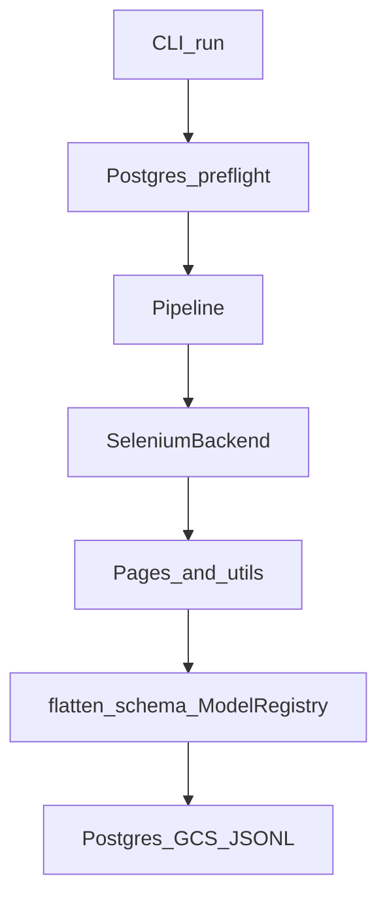

# Extraction flow (link-first)

End-to-end mental model for **one scrape run**. For field-level detail, follow links.

## Step-by-step

1. **`Slug-Ig-Crawler`** (`cli.py`) resolves config, runs **Postgres preflight** (`crawled_posts` / `crawled_comments`), then constructs `Pipeline`.
2. **`Pipeline`** loads config, builds `SeleniumBackend` and `GraphQLModelRegistry`, chooses **profile** vs **URL file** mode (README mode table).
3. **`SeleniumBackend`** drives Chrome (optionally Docker), cookies, CDP/network capture, and delegates **page-level** actions to `pages/` and shared helpers in `utils.py`.
4. **Captured GraphQL** responses are normalized with **`flatten_schema.yaml`** via `GraphQLModelRegistry.flatten_response` (and related helpers); **Pydantic** models validate interesting subtrees per `MODEL_REGISTRY`.
5. **Outputs** land in configured paths; optional **GCS** upload; **enqueue** rows reference paths and **`thor_worker_id`** ([thor-handshake.md](../contracts/thor-handshake.md)).

## Related contracts

- [scrape-run-contract.md](../contracts/scrape-run-contract.md) — preflight, modes, vocabulary.
- [parser-output-contract.md](../contracts/parser-output-contract.md) — critical `xdt_api__*` keys.
